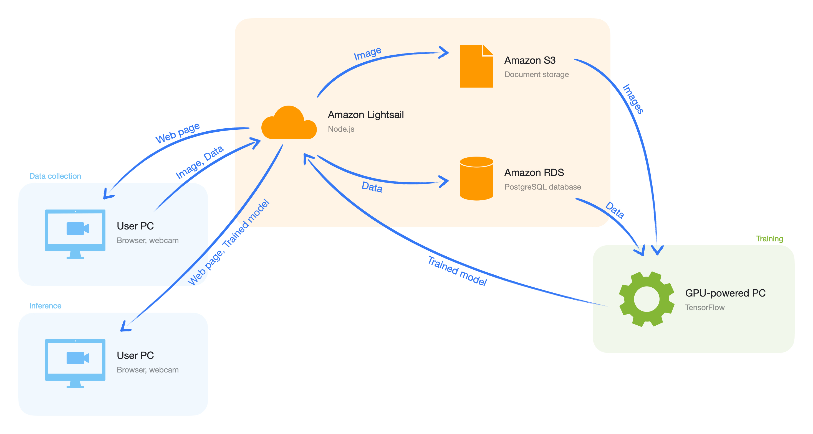
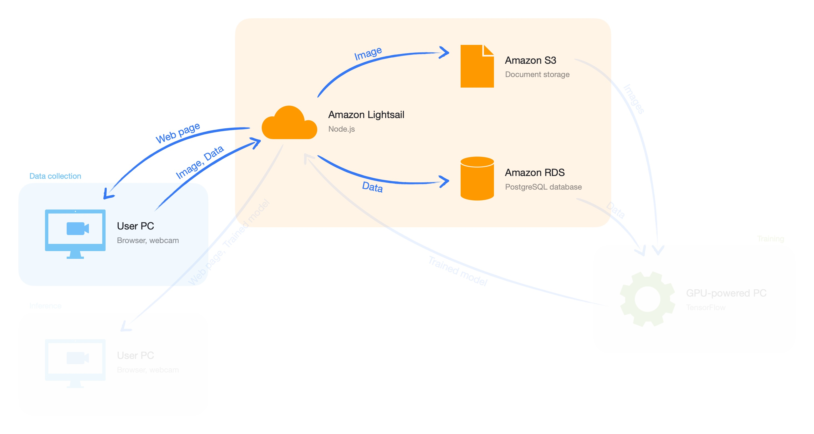
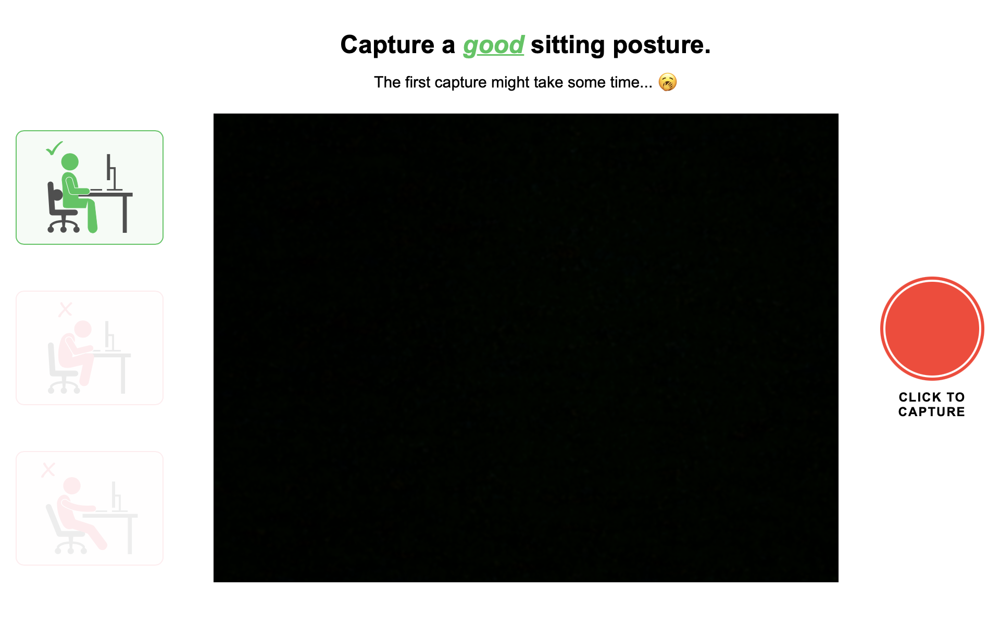
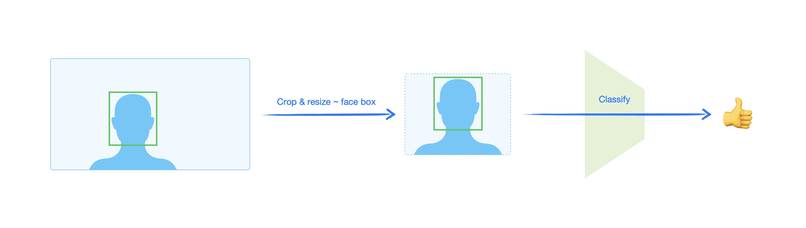
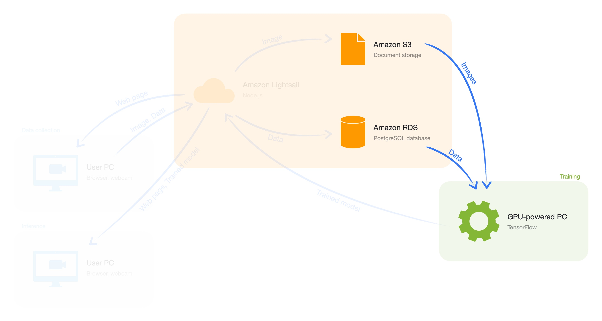
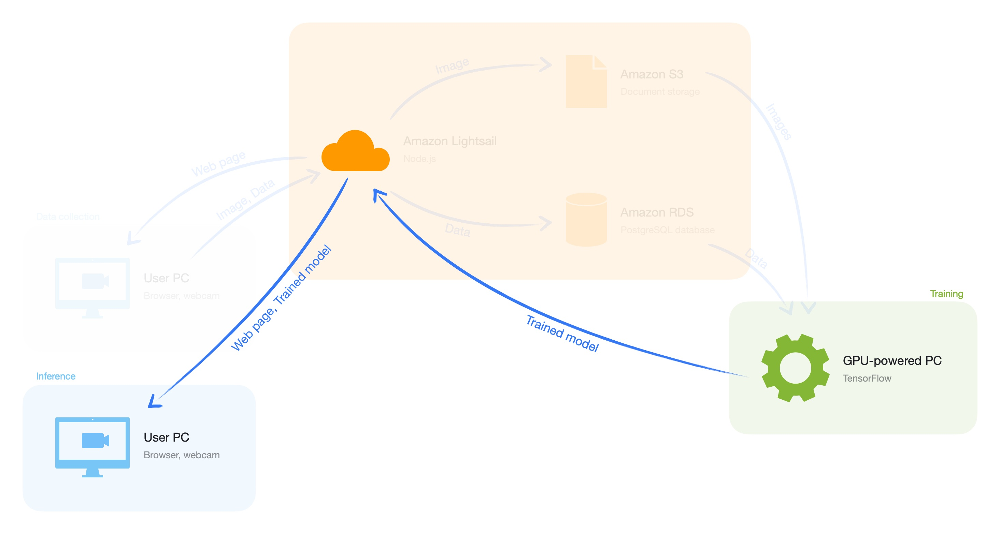

# Sitting posture coach

## Introduction

Maintaining a good sitting posture while working is extremely important. This is especially true when working from home, where ergonomic office equipment might not be available and there is less incentive to sit up straight. Bad sitting posture is a major cause of back pain, neck pain, headaches and even spinal disfunction. 

Sitting posture coach aims to provide a solution which is easy to set up and needs no additional infrastructure. A simple web page will provide feedback to help you attain a better sitting posture. It uses an AI system running locally in your browser (and thus preserving your privacy) that analyses live images from your webcam.

This page will provide an overview of the architecture of the system. Visit [https://sitting-posture.coach](https://sitting-posture.coach) for a live version of the app, or take a look at [the setup instructions](setup) to set it up yourself.

## High-Level Overview

The following figure gives a high-level overview of the system. 



A node.js app (running on Amazon LightSail) will serve web pages for inference and data collection. Collected data is stored in the cloud. Images are stored as objects (in an Amazon S3 bucket), the corresponding metadata is stored in a database (PostgreSQL). This data is used to train a classification model. The trained model is converted to run in the browser (TFJS) and made available by the node.js app. 

## Data collection



Visit [https://sitting-posture.coach/data](https://sitting-posture.coach/data) to see the web app for data collection (and help improve our model while you're at it). The Media Capture and Stream API is used to show a live webcam stream and to record images whenever the record button is clicked. Note that an SSL-certificate is needed in order to use this API after deploying the app. Amazon Lightsail provides a [simplified way](https://lightsail.aws.amazon.com/ls/docs/en_us/articles/amazon-lightsail-using-lets-encrypt-certificates-with-wordpress) to set this up, provided a domain name is available.

Three sitting posture modes are used: a good posture, a bad posture leaning forward and a bad posture leaning backward.



The captured image and some accompanying metadata (a unique random session id, the posture mode, the image index) are sent to the back-end. Images are stored as objects (in an Amazon S3 bucket), the corresponding metadata is stored in a database (PostgreSQL).

At the time of writing this report, we collected 291 images.

## Data preprocessing

To ensure maximum data efficiency, the webcam images are preprocessed with a face detection pipeline. The goal is to deliver input images to the sitting posture classification model that are consistent in terms of scale and position of the face. This alleviates the task for the posture model, because the model need not handle different scales (a face moving further or closer to the webcam) or positions of the face on the webcam image.

An off the shelve face detection model is used available through the [MediaPipe API](https://google.github.io/mediapipe/solutions/face_detection.html). The coordinates of the bounding box are used to determine the crop around the face in the webcam image. The bottom center of the bounding box is the center of the crop, and the side of the square crop is the geometric mean multiplied with a factor 4. The resulting crop shows the face, neck and shoulders, which are the relevant regions to determine sitting posture. If information is missing because the detected face is too close to the edge of the webcam image, zero (black) padding is applied.



## Model & training



A relatively simple image classification model was used to predict a sitting posture score from the preprocessed images. When creating train / validation / test splits, case was taken to ensure the same person was only present in one group. We trained for 35 epochs with a batch size of 8. We used the Adam optimizer with a learning rate of 3e-4. We tried a number of different learning rates but 3e-4 worked best, validated on the validation set. The model started overfitting on the training set when training longer than 35 epochs. Because the model is fairly simple, training takes less than a minute on a GTX 2080 Ti.

```
Model: "model"
_________________________________________________________________
Layer (type)                 Output Shape              Param #   
=================================================================
input_1 (InputLayer)         [(None, 128, 128, 3)]     0         
_________________________________________________________________
conv2d (Conv2D)              (None, 126, 126, 16)      448       
_________________________________________________________________
max_pooling2d (MaxPooling2D) (None, 42, 42, 16)        0         
_________________________________________________________________
conv2d_1 (Conv2D)            (None, 40, 40, 16)        2320      
_________________________________________________________________
max_pooling2d_1 (MaxPooling2 (None, 13, 13, 16)        0         
_________________________________________________________________
conv2d_2 (Conv2D)            (None, 11, 11, 16)        2320      
_________________________________________________________________
max_pooling2d_2 (MaxPooling2 (None, 3, 3, 16)          0         
_________________________________________________________________
conv2d_3 (Conv2D)            (None, 1, 1, 16)          2320      
_________________________________________________________________
flatten (Flatten)            (None, 16)                0         
_________________________________________________________________
dense (Dense)                (None, 1)                 17        
=================================================================
Total params: 7,425
Trainable params: 7,425
Non-trainable params: 0
```


Violin plot of the output of the model on the validation dataset.

## Inference



The trained model is converted and saved as a TensorFlow.js model that can be run in a browser. This model is used by the inference web page, made available through the node.js back-end. It again uses the Media Capture and Stream API to capture webcam images. 

These images are first preprocessed in the same way as the labelled images were preprocessed to train the model. The default [TensorFlow blazeface](https://github.com/tensorflow/tfjs-models/tree/master/blazeface) model is used to detect the user's face. Conveniently, this is the exact same model as we used in the preprocessing pipeline, where it was easily available through the [MediaPipe API](https://google.github.io/mediapipe/solutions/face_detection.html). Also the cropping and rescaling had to be ported to JavaScript, this is done using the CanvasRenderingContext2D API. The resulting image is sent to the TensorFlow.js model. The resulting posture score is used to update the UI.

## About

This project was created by [Rembert Daems](https://be.linkedin.com/in/rembert-daems) and [Peter De Roovere](https://twitter.com/peterderoovere) as part of the [2021 Full Stack Deep Learning Course](https://fullstackdeeplearning.com/).
